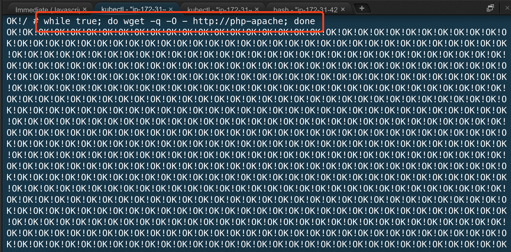
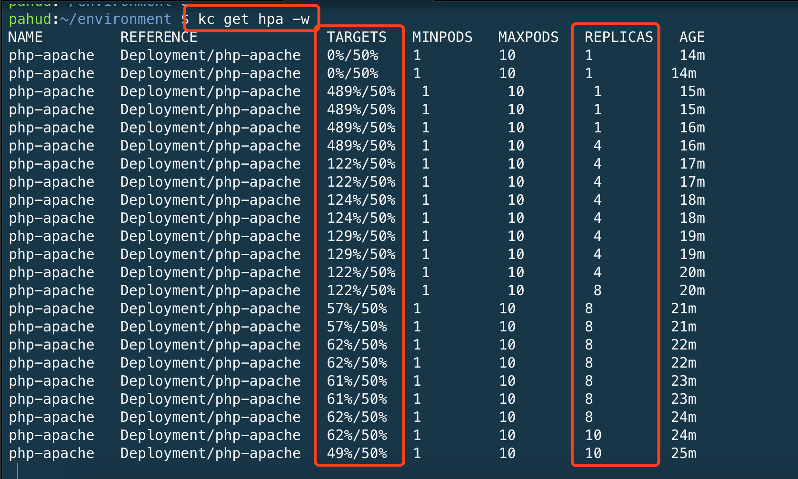

# HPA(Horizontal Pod Autoscaling)

### Prerequisities

[Create your Amazon EKS cluster with eksctl](https://github.com/pahud/amazon-eks-workshop/blob/master/00-getting-started/create-eks-with-eksctl.md)

[Customize your nodegroup(worker nodes)](https://github.com/pahud/amazon-eks-workshop/blob/master/01-nodegroup/customize-nodegroup.md) **make sure to use the latest EKS-optimized AMI*

make sure your Amazon EKS cluster is **eks.2** platform ([platform versions](https://docs.aws.amazon.com/eks/latest/userguide/platform-versions.html))


### Install the metrics-server


git clone the metrics-server from https://github.com/kubernetes-incubator/metrics-server

```
$ kc apply -f deploy/1.8+/
clusterrolebinding.rbac.authorization.k8s.io "metrics-server:system:auth-delegator" created
rolebinding.rbac.authorization.k8s.io "metrics-server-auth-reader" created
apiservice.apiregistration.k8s.io "v1beta1.metrics.k8s.io" created
serviceaccount "metrics-server" created
deployment.extensions "metrics-server" created
service "metrics-server" created
clusterrole.rbac.authorization.k8s.io "system:metrics-server" created
clusterrolebinding.rbac.authorization.k8s.io "system:metrics-server" created
```


check `/apis/metrics.k8s.io/v1beta1/nodes` and make sure you receive the JSON response.

```
$ kc get --raw "/apis/metrics.k8s.io/v1beta1/nodes" | jq .
{
  "kind": "NodeMetricsList",
  "apiVersion": "metrics.k8s.io/v1beta1",
  "metadata": {
    "selfLink": "/apis/metrics.k8s.io/v1beta1/nodes"
  },
  "items": []
}
```


create an deployment and service

```
$ kc run php-apache --image=k8s.gcr.io/hpa-example --requests=cpu=200m --expose --port=80
service "php-apache" created
deployment.apps "php-apache" created
```


create HPA

```
$ kc autoscale deployment php-apache --cpu-percent=50 --min=1 --max=10
deployment.apps "php-apache" autoscaled
```

get the hpa

```
$ kc get hpa
```


You probably will see `<unknown>/50% ` for 1-2 minutes and then you should be able to see `0%/50%` like as above.


### Validation

Run a log-generator and execute a while loop to get `http://php-apache` like below

```
$ kc run -i --tty load-generator --image=busybox /bin/sh
If you don't see a command prompt, try pressing enter.
# while true; do wget -q -O - http://php-apache; done
OK!OK!OK!OK!OK!OK!OK!OK!OK!OK!OK!OK!OK!OK!OK!OK!OK!OK!OK!OK!OK!OK!OK!OK!OK!OK!OK!OK!OK!OK!OK!OK!OK!OK!OK!OK!OK!OK!OK!OK!OK!OK!OK!OK!OK!OK!OK!OK!OK!OK!OK!OK!OK!OK!OK!OK!OK!OK!OK!OK!OK!OK!OK!OK!OK!OK!OK!OK!OK!OK!OK!OK!OK!OK!OK!OK!OK!OK!OK!OK!OK!OK!OK!OK!OK!OK!OK!OK!OK!OK!OK!OK!OK!OK!
(you'll see a lot of OK! like above)
```




Leave this terminal running and open another terminal in Cloud9 and run

```
$ kc get hpa -w
```

Watch the screen and see how HPA scales the pods from 1 to 10 and eventually brings down the service loading under the targets(50%)




# Further Reading

Introducing Horizontal Pod Autoscaling for Amazon EKS | AWS Open Source Blog - https://aws.amazon.com/tw/blogs/opensource/horizontal-pod-autoscaling-eks/

Horizontal Pod Autoscaler - Kubernetes - https://kubernetes.io/docs/tasks/run-application/horizontal-pod-autoscale/

